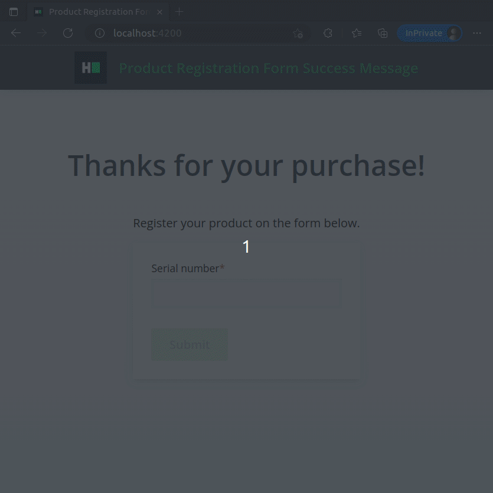

# Angular: Product Registration Form Success Message

* Score: 75
* Recommended Time: 45 minutes
* Tags:
    * Frontend
    * Medium
    * Angular
* Environment:
    * Node.js: v14.x (LTS, Fermium)
    * Angular: v14.2.10 (LTS)
* Repository: https://github.com/ProblemSetters/1506577-angular-product-registration-form-success-message
* Link: https://www.hackerrank.com/x/tests/all/1560716/questions/1506577/edit

---

A product registration app is a visual component for registering a product after purchase using its serial number.

It contains two functional parts that should be combined within this task:

- a product registration form
- a success message that appears after form submission

The user interface design phase is complete, but some functional requirements are missing as specified in the
user stories below.

**User Stories**

1. The user should complete the product registration form in the `/` path, specifying the serial number of the product.
2. The user should be sent to the path `/success` to see a success message to confirm that the registration was
   successful.
   The success message should be hidden initially.
   It should include the serial number of the registered product.

**Notes**

- To complete the task, use Angular routing in the context of a Single Page Application (SPA).
